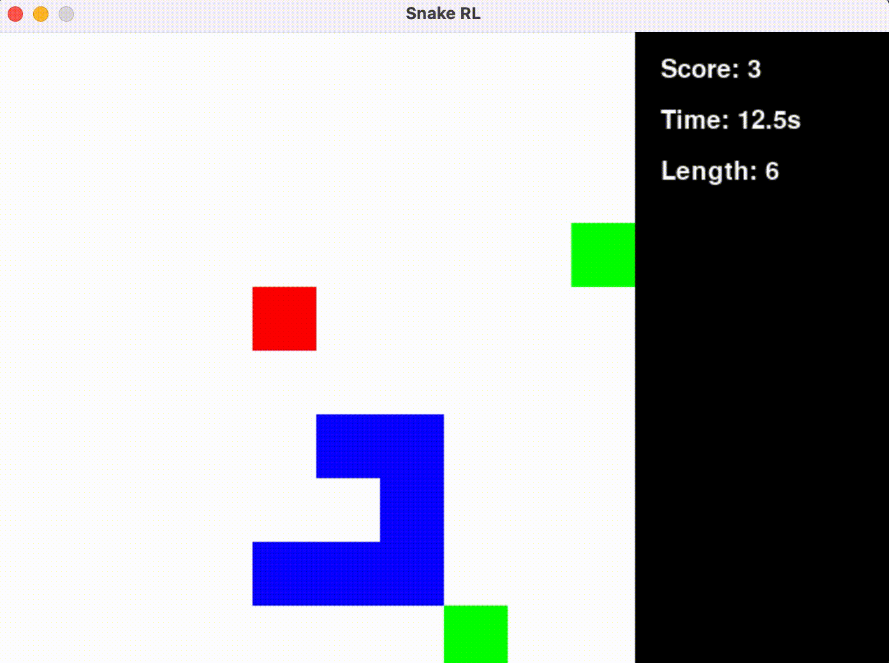

<!--
**Np93/Np93** is a ✨ _special_ ✨ repository because its `README.md` (this file) appears on your GitHub profile.

Here are some ideas to get you started:

- 🔭 I’m currently working on ...
- 🌱 I’m currently learning ...
- 👯 I’m looking to collaborate on ...
- 🤔 I’m looking for help with ...
- 💬 Ask me about ...
- 📫 How to reach me: ...
- 😄 Pronouns: ...
- ⚡ Fun fact: ...
-->

<h1 align="center">Hi there, I'm Nicolas Hirzel 👋</h1>

## 🚀 GitHub Actions Demo

Fullstack Developer · Data & AI Engineering · Systems Design

  
  
  
  
  
  
  
  
  
  

---

## Featured Projects

### Learn2Slither – Snake AI (Q-Learning)

> A self-learning Snake powered by Q-Learning with graphical interface and model export

**Tech stack**: `Python`, `Pygame`, `Q-learning`, `Numpy`, `Poetry`  
[View project](https://github.com/Np93/Learn2Slither)

---

<!-- ### Gomoku AI – Strategic Game with MinMax AI

> MinMax AI implemented in C++ with Pybind11 bridge and heuristics, fully playable UI

**Tech stack**: `C++`, `Pybind11`, `Python`, `Pygame`, `MinMax`, `Game Heuristics`  
[View project](https://github.com/Np93/GomokuAI) -->

<!-- --- -->

<!-- ### MatchApp – Real-Time Dating Platform

> Matching, filters, chat, video calls – built from scratch with async API and modern UI

**Tech stack**: `FastAPI`, `React`, `PostgreSQL`, `WebRTC`, `Tailwind CSS`, `Docker`  
[View project](https://github.com/Np93/MatchApp) -->

<!-- --- -->

## Technical Overview

| Area            | Skills |
|------------------|--------|
| **Languages**     | `Python`, `C`, `C++`, `TypeScript` |
| **Backend**       | `FastAPI`, `SQL`, `CI/CD`, `Azure`, `Pytest` |
| **Frontend**      | `React`, `Tailwind`, `WebSocket` |
| **AI / Data**     | `Q-learning`, `Computer Vision`, `Sklearn`, `OpenCV` |
| **DevOps**        | `Docker`, `GitHub Actions`, `Poetry`, `Makefile` |

---

## Most Used Languages

---